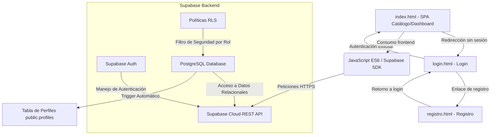

# 📦 Sistema de Control de Inventario y Alertas - Tienda de Abarrotes

Un panel de administración y compras interactivo web (Dashboard) diseñado bajo estándares modernos de diseño visual, responsivo y multirol. Permite llevar el monitoreo del stock de productos, automatizar alertas de stock crítico por desabasto y facultar a los clientes a registrar pedidos que decrementan el inventario en tiempo real.

Este proyecto ha sido optimizado para funcionar con una arquitectura híbrida integrada por una **SPA (Single Page Application)** estática para el catálogo y panel administrativo, y **páginas web independientes y despejadas** para el flujo de autenticación (Login y Registro). Está completamente preparado para su despliegue autónomo en **GitHub Pages**, conectándose de forma directa y segura con **Supabase** como backend en la nube.

---

## 🎯 Objetivos del Proyecto

El sistema de abarrotes resuelve problemas logísticos de control y ventas al digitalizar las operaciones manuales de una tienda física:

1.  **Monitoreo Inteligente de Existencias**: Evita las pérdidas por desabasto gracias a un panel dinámico que calcula en tiempo real qué productos han caído por debajo de su umbral mínimo permitido.
2.  **Alertas Automáticas de Stock Crítico**: Resalta de forma inmediata y visualmente muy clara (en rojo suave) los productos que requieren reabastecimiento urgente, optimizando la cadena de reposición.
3.  **Gestión de Ventas Multiusuario**:
    *   **Administrador**: Modifica la base de datos de productos (CRUD completo) y monitorea/actualiza los pedidos pendientes recibidos de clientes.
    *   **Cliente**: Explora la tienda interactiva, añade artículos al carrito de compra, valida la cantidad de stock restante y realiza compras seguras.
4.  **Sincronización en Tiempo Real**: Persiste toda la lógica y datos en la nube de forma transparente y con baja latencia.

---

## 📐 Arquitectura de Software

El sistema funciona bajo una estructura cliente-servidor desacoplada que permite alojar la interfaz en servidores estáticos (CDN de GitHub Pages) consumiendo APIs seguras:



### Flujo de Funcionamiento:
1.  **Frontend (Capa de Presentación)**: Una estructura limpia basada en una SPA responsiva para el panel administrativo y catálogo (`index.html`), junto con pantallas independientes, amplias y minimalistas de acceso (`login.html` y `registro.html`) desarrolladas en Vanilla HTML5, CSS3 Premium (Glassmorphism, animaciones fluidas) y JavaScript modular (ES6+).
2.  **Comunicación (Capa de Negocio)**: El SDK oficial de Supabase realiza peticiones HTTPS directas. Las variables de configuración de red se cargan dinámicamente desde `js/config.js` y son consumidas de forma segura.
3.  **Base de Datos (Capa de Persistencia)**: Almacenamiento PostgreSQL hospedado en Supabase Cloud. La seguridad de inserción/edición se gestiona a través de políticas **RLS (Row Level Security)** que restringen las acciones de los clientes. Un **trigger** interno a nivel de base de datos intercepta los nuevos registros de autenticación en la tabla de auth y les asigna su respectivo rol de perfil automáticamente en la tabla pública.

---

## 🛠️ Stack Tecnológico

El proyecto está diseñado para ser ligero, sumamente rápido y sin necesidad de procesos de compilación pesados, usando tecnologías nativas modernas:

*   **Frontend**:
    *   **HTML5**: Estructura de layout, contenedores dinámicos para la SPA, páginas dedicadas e independientes de Login y Registro, y ventanas modales de interacción.
    *   **Vanilla CSS3 (Premium Style)**: Diseño visual con variables CSS personalizadas, sombras de resplandor (*glow*), transparencias con filtros de desenfoque de fondo (*Glassmorphism*), y transiciones fluidas de `cubic-bezier`. 
    *   **JavaScript (ES6+)**: SPA con enrutamiento interno reactivo (sin recargas de página) para el dashboard, controladores asíncronos independientes para los formularios de acceso, manejo de estados (`AppState`), buscador híbrido en memoria, gestión interactiva de carrito de compras y notificaciones Toast flotantes en vivo.
    *   **Iconos**: Biblioteca vectorizada ligera de **Lucide Icons** para dotar a la interfaz de iconos nítidos y adaptables.
*   **Backend & Base de Datos**:
    *   **Supabase (BaaS)**: Infraestructura Cloud que provee servicios de bases de datos relacionales y gestión de sesiones de usuario (Auth).
    *   **PostgreSQL**: Motor de base de datos relacional de nivel corporativo para consultas estructuradas de inventario y transacciones seguras de compra.

---

## 🗄️ Modelo de Datos (Relacional & Cloud)

La base de datos del proyecto se implementa en un motor **Relacional** (PostgreSQL) y su ubicación es **Externa en la nube**, provista por Supabase. 

Se compone de cuatro entidades principales relacionadas mediante llaves foráneas (`Foreign Keys`) con borrado y restricción en cascada:

```
                  +-----------------------+
                  |    auth.users         |
                  +-----------+-----------+
                              | (1:1)
                              v
                  +-----------+-----------+
                  |    public.profiles    |
                  +-----------+-----------+
                              | (1:N)
                              v
                  +-----------+-----------+
                  |    public.pedidos     |
                  +-----------+-----------+
                              | (1:N)
                              v
                  +-----------+-----------+
                  | public.detalles_pedido|
                  +-----------+-----------+
                              | (N:1)
                              v
                  +-----------+-----------+
                  |   public.productos    |
                  +-----------------------+
```

### Detalle de las Tablas:

#### 1. Tabla: `public.profiles`
Guarda el perfil detallado del usuario en base a su autenticación.
*   `id` (`uuid`, Primary Key): Enlazado a `auth.users.id` con borrado en cascada.
*   `email` (`text`): Dirección de correo electrónico de registro.
*   `nombre` (`text`): Nombre o razón social del usuario.
*   `rol` (`text`): Permisos dentro del sistema (`'admin'` o `'cliente'`). Por defecto es `'cliente'`.
*   `creado_en` (`timestamp`): Fecha automática de alta.

#### 2. Tabla: `public.productos`
Contiene la lista del inventario de abarrotes.
*   `id` (`uuid`, Primary Key): Generador de identificador aleatorio único.
*   `nombre` (`text`): Nombre comercial del producto de abarrotes.
*   `categoria` (`text`): Categoría del producto (Bebidas, Lácteos, Despensa, etc.).
*   `precio` (`numeric(10,2)`): Costo de venta al público.
*   `stock` (`integer`): Cantidad de existencias físicas disponibles.
*   `stock_minimo` (`integer`): Cantidad mínima bajo la cual la fila se resaltará en rojo en el panel administrativo.
*   `imagen_url` (`text`): Enlace de internet a la imagen del artículo.
*   `codigo_barras` (`text`): Código del escáner para búsquedas rápidas.

#### 3. Tabla: `public.pedidos`
Encabezado de compras realizadas por los clientes.
*   `id` (`uuid`, Primary Key): ID único del pedido.
*   `cliente_id` (`uuid`, Foreign Key): Referencia al perfil del comprador en `profiles.id`.
*   `total` (`numeric(10,2)`): Suma total facturada del pedido.
*   `estado` (`text`): `'pendiente'`, `'completado'` o `'cancelado'`.
*   `creado_en` (`timestamp`): Fecha y hora del registro de compra.

#### 4. Tabla: `public.detalles_pedido`
Detalle desgolsado de los artículos asociados a cada pedido.
*   `id` (`uuid`, Primary Key): Identificador de registro.
*   `pedido_id` (`uuid`, Foreign Key): Relaciona con la cabecera `pedidos.id`.
*   `producto_id` (`uuid`, Foreign Key): Relaciona con el producto adquirido en `productos.id`. Restringe su borrado si forma parte de una orden histórica.
*   `cantidad` (`integer`): Número de unidades compradas de este artículo.
*   `precio_unitario` (`numeric(10,2)`): Precio histórico del artículo al momento de realizar la compra.

---

## 🤖 Metodología con Inteligencia Artificial

Para acelerar de forma drástica y estructurada el desarrollo del software, se empleó la herramienta de codificación basada en IA **Antigravity (motorizado por Gemini 3.5 Flash)** de Google DeepMind en pareja con el desarrollador:

1.  **Diseño Arquitectónico Inteligente**: La IA asistió en la planeación y estructuración del modelo relacional en PostgreSQL para Supabase, optimizando la creación de triggers dinámicos del servidor y definiendo políticas Row Level Security (RLS) seguras.
2.  **Desarrollo de Lógica Reactiva y Enrutamiento**: El motor de IA escribió y refinó el controlador de la SPA en JavaScript, aplicando principios de inyección de componentes reutilizables a fin de garantizar un código escalable, limpio y altamente interactivo.
3.  **Estilizado Premium Personalizado**: Se diseñó una interfaz rica y exclusiva con CSS3 moderno en lugar de frameworks preestablecidos. La IA co-creó el sistema estético que soporta Glassmorphism (efectos de cristal translúcido), gradientes dinámicos y la transformación responsiva móvil que colapsa filas de tablas en tarjetas de lectura cómodas en teléfonos.
4.  **Robustez y Manejo de Errores**: La IA facilitó la creación del middleware transaccional de compras, el cual descuenta inventario automáticamente y tiene la inteligencia de retornar el stock en caso de cancelaciones de pedidos de clientes por parte del Administrador.
